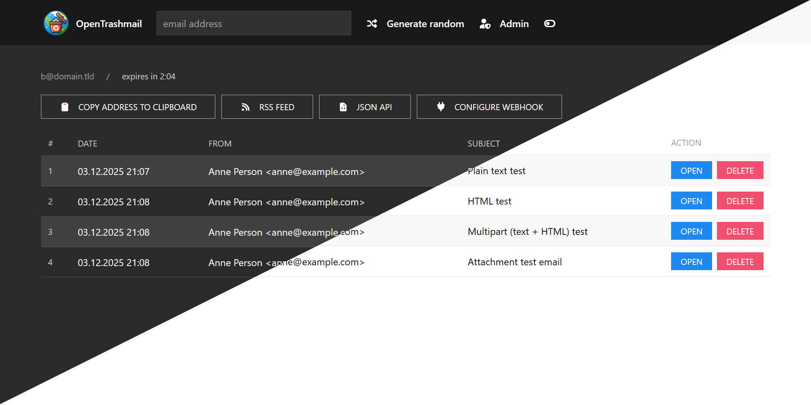

<p align="center">
  <a href="" rel="noopener">
    
  </a>
</p>

<h1 align="center">OpenTrashmail</h1>

<p align="center">
  <sub>
    This repository is a private fork of
    <a href="https://github.com/HaschekSolutions/opentrashmail">HaschekSolutions/opentrashmail</a>.<br>
    Huge thanks and credit to the original author and contributors for creating and sharing such a great tool!
  </sub>
</p>

<div align="center">


[](https://hub.docker.com/r/abyssox/opentrashmail)
[](https://github.com/abyssox/opentrashmail/actions)
[](https://github.com/abyssox/opentrashmail/blob/master/LICENSE)
[](https://hits.seeyoufarm.com)
[](https://github.com/abyssox/opentrashmail)

#### Self-hosted `trashmail` solution — Receive emails via `Web UI`, `JSON API`, `RSS feed` and **custom webhooks**

</div>

---



## Changelog

See the [Changelog](CHANGELOG.md).

---

## Features

- Python-based SMTP server that accepts mail for any domain with no extra setup
- `RSS feed` for every email address
- `JSON API` for integrating into your own tools (perfect for automating 2FA email handling)
- `Webhooks` with per-address configuration and fully customizable JSON payloads
- Handles attachments out of the box
- Supports `plaintext` SMTP, `STARTTLS`, and `TLS-on-connect`
- Ephemeral email addresses that `auto-expire` after 15 minutes
- Web interface:
    - Light/dark mode toggle
    - Automatic checking for new emails
    - Download attachments
    - Delete emails
    - Generate random email addresses
    - Admin view for server logs and all accounts
- 100% file-based storage - `no database required`
- Ideal as an email honeypot or automation backend for handling 2FA and other transactional emails
---

## General API endpoints

| Endpoint                                   | Explanation                                                                                                                                            | Example output                                                                 |
|-------------------------------------------|--------------------------------------------------------------------------------------------------------------------------------------------------------|--------------------------------------------------------------------------------|
| `/rss/[email-address]`                    | Renders RSS XML for RSS clients to render emails                                                                                                      | [](https://pictshare.net/ysu5qp.png)      |
| `/api/raw/[email-address]/[id]`           | Returns the raw email of the address. **Warning:** output can be as large as the email itself (up to ~20 MB for large attachments)                   | [](https://pictshare.net/pkb49p.png)      |
| `/api/attachment/[email-address]/[id]`    | Returns the specified attachment with the correct MIME type                                                                                            |                                                                                |
| `/api/delete/[email-address]/[id]`        | Deletes a specific email message and its attachments                                                                                                  |                                                                                |
| `/api/deleteaccount/[email-address]`      | Deletes all messages and attachments of this email account                                                                                            |                                                                                |
| `/api/webhook/get/[email-address]`        | Get webhook configuration for an email address                                                                                                        |                                                                                |
| `/api/webhook/save/[email-address]`       | Save webhook configuration for an email address                                                                                                       |                                                                                |
| `/api/webhook/delete/[email-address]`     | Delete webhook configuration for an email address                                                                                                     |                                                                                |

---

## JSON API

| Endpoint                           | Explanation                                                                                                                                                                                         | Example output                                                                 |
|------------------------------------|-----------------------------------------------------------------------------------------------------------------------------------------------------------------------------------------------------|--------------------------------------------------------------------------------|
| `/json/[email-address]`           | Returns an array of received emails with links to attachments and the parsed text-based body of the email. If the `ADMIN` email is entered, returns all emails of all accounts                      | [](https://pictshare.net/sflw6t.png) |
| `/json/[email-address]/[id]`      | Use the ID from the previous call to get all data of a received email: raw content and HTML body. Can be large because attachments may be present in base64                                       | [](https://pictshare.net/eltku4.png) |
| `/json/listaccounts`              | If `SHOW_ACCOUNT_LIST` is set to `true` in `config.ini`, returns an array of all email addresses which have received at least one email                                                          | [](https://pictshare.net/u6agji.png) |

---

## Configuration (`config.ini`)

Edit `config.ini` to configure the server. Available settings:

- `URL`  
  The URL under which the GUI will be hosted. No trailing slash.  
  Example: `https://trashmail.domain.tld`

- `DOMAINS`  
  Comma-separated list of domains this mail server will receive emails on. Used by the web interface to generate random addresses.

- `MAILPORT`  
  Port the Python-powered SMTP server will listen on.  
  **Default:** `25`

- `ADMIN`  
  An email address (doesn't have to exist, just has to be valid) that will list all emails of all addresses the server has received. Works as a catch-all in the UI/API.

- `DATEFORMAT`  
  How timestamps are shown in the web interface (uses [moment.js syntax](https://momentjs.com/docs/#/displaying/)).

- `PASSWORD`  
  If set, the site and API cannot be used without providing it via form, POST/GET variable `password` or HTTP header `PWD`.  
  Example: `curl -H "PWD: 123456" http://localhost:8080/json...`

- `ALLOWED_IPS`  
  Comma-separated list of IPv4 or IPv6 CIDR addresses that are allowed to use the web UI or API.

- `ATTACHMENTS_MAX_SIZE`  
  Maximum size of each individual attachment in bytes.

- `MAILPORT_TLS`  
  If set to a value > 0, this port is used for TLS on connect (TLSC). Plaintext auth will not be possible. Usually set to `465`. Requires `TLS_CERTIFICATE` and `TLS_PRIVATE_KEY`.

- `TLS_CERTIFICATE`  
  Path to the certificate (chain). Can be relative to the `/python` directory or absolute.

- `TLS_PRIVATE_KEY`  
  Path to the private key of the certificate. Can be relative to the `/python` directory or absolute.

- `WEBHOOK_URL`  
  Global webhook URL. If set, all emails will send a POST request with the JSON representation of the email as body (unless overridden by a per-email webhook).

- `ADMIN_ENABLED`  
  Enables the admin menu.  
  **Default:** `false`

- `ADMIN_PASSWORD`  
  If set, this password is required to access the admin menu.

- `SHOW_ACCOUNT_LIST`
  If set to `true` a list of all email addresses which have received at least one email is available via API and admin menu.

- `SHOW_LOGS`
  If set to `true` a page with all logfiles and the current config is available in admin menu.  

---

## Docker environment variables

When running via Docker, the following environment variables are supported:

| ENV var                | Description                                                                                                               | Example values                                    |
|------------------------|---------------------------------------------------------------------------------------------------------------------------|---------------------------------------------------|
| `URL`                  | URL of the web interface. Used by the API and RSS feed                                                                    | `http://localhost:8080`                           |
| `DISCARD_UNKNOWN`      | Whether to delete emails addressed to domains that are not configured                                                     | `true`, `false`                                   |
| `DOMAINS`              | Whitelisted domains the server will listen for. If `DISCARD_UNKNOWN=false`, used only to generate random emails           | `example.com,example.org`                         |
| `SHOW_ACCOUNT_LIST`    | If set to `true` a list of all email addresses which have received at least one email is available via API and admin menu | `true`, `false`                                   |
| `ADMIN`                | If set to a valid email, entering it in API or web interface shows all emails of all accounts (catch-all)                 | `test@test.com`                                   |
| `DATEFORMAT`           | Date format used in the web interface (see [moment.js](https://momentjs.com/))                                            | `"MMMM DD YYYY, h:mm:ss a"`                       |
| `SKIP_FILEPERMISSIONS` | If `true`, won't fix file permissions for the data folder in the container (useful for local dev). Default `false`        | `true`, `false`                                   |
| `PASSWORD`             | If configured, site and API require this password (form, GET/POST `password` or header `PWD`)                             | `your-strong-password`                            |
| `ALLOWED_IPS`          | Comma-separated list of IPv4/IPv6 CIDR ranges allowed to use the web UI or API                                            | `192.168.5.0/24,2a02:ab:cd:ef::/60,172.16.0.0/16` |
| `ATTACHMENTS_MAX_SIZE` | Max size per email attachment in bytes                                                                                    | `2000000` (= 2MB)                                 |
| `MAILPORT_TLS`         | Port used for TLS on connect (TLSC). Requires `TLS_CERTIFICATE` and `TLS_PRIVATE_KEY`                                     | `465`                                             |
| `TLS_CERTIFICATE`      | Path to the certificate (chain). Relative to `/python` or absolute                                                        | `/certs/cert.pem` or `cert.pem`                   |
| `TLS_PRIVATE_KEY`      | Path to the certificate's private key. Relative to `/python` or absolute                                                  | `/certs/privkey.pem` or `key.pem`                 |
| `WEBHOOK_URL`          | Global webhook URL to receive email JSON payloads                                                                         | `https://example.com/webhook`                     |
| `ADMIN_ENABLED`        | Enables the admin menu                                                                                                    | `false`, `true`                                   |
| `ADMIN_PASSWORD`       | Password to protect the admin menu                                                                                        | `123456`                                          |
| `SHOW_LOGS`            | If set to `true` a page with all logfiles and the current config is available in admin menu                               | `true`, `false`                                   |
| `TZ`                   | Timezone used inside the docker container.                                                                                | `Europe/Berlin`                                   |
---

## TLS

Since v1.3.0 TLS and STARTTLS are supported by OpenTrashmail.

### TLS modes

There are two ways to use TLS with email:

1. **STARTTLS**
2. **TLS on Connect (TLSC)**

**STARTTLS**  
Does not require a specific port. The connection starts as plaintext and upgrades to TLS if the server advertises the `STARTTLS` command (OpenTrashmail does this automatically if certificate settings are configured). Since it runs on the default `MAILPORT`, you don’t need to open additional ports.

**TLS on connect (TLSC)**  
TLS wraps the connection from the start, so plaintext communication is not possible. This typically uses port `465` and must be configured separately via `MAILPORT_TLS`.

### Certificates

For TLS to work you need a certificate that matches the hostname of the SMTP server. This can be done using Let’s Encrypt, including wildcard certificates.

For testing environments you can create a self-signed certificate from inside the `python` folder:

```bash
openssl req -x509 -newkey rsa:4096 -keyout key.pem -out cert.pem \
  -days 365 -nodes -subj '/CN=localhost'
```

Then set `MAILPORT_TLS` (if you want TLSC), `TLS_CERTIFICATE` and `TLS_PRIVATE_KEY`.

### Testing TLS

The file [/docs/Dev.md](/docs/Dev.md) contains hints on how to debug and test TLS/STARTTLS/TLSC connections using `swaks`, which should be available in most package managers.

---

## How it works

The heart of OpenTrashmail is a **Python-powered SMTP server** that listens for incoming emails and stores them as JSON files.

- The server doesn’t need to “know” the right email domain — it will **catch everything** it receives.
- You only need to **expose port 25 to the internet** and set an **MX record** of your domain pointing to the IP address of your machine.

---

## Quick start

### 1. Set MX records

In your DNS panel, create an MX record for your domain pointing to the IP of the server hosting OpenTrashmail.

Simple example to receive emails at `example.com`:

```zonefile
mail.example.com.  IN  A   93.184.216.34
example.com.       14400  IN  MX  10  mail.example.com.
```

Wildcard example (works with subdomains):

```zonefile
mail.example.com.  IN  A   93.184.216.34
*.example.com.     14400  IN  MX  10  mail.example.com.
```

Combined with `DOMAINS="*.example.com"` (e.g. Docker `-e DOMAINS="*.example.com"`), this allows you to use any address under any subdomain, e.g.:

- `test@robot.example.com`
- `john@lynn.example.com`

### 2. Running in Docker (preferred)

**Simple start, no persistence:**

```bash
docker run -it \
  -p 25:25 -p 80:80 \
  -e URL="https://localhost:80" \
  abyssox/opentrashmail:latest
```

**With persistent data directory on host:**

```bash
docker run \
  -p 80:80 -p 25:25 \
  -e URL="https://localhost:80" \
  -v /path/on/host/where/to/save/data:/var/www/opentrashmail/data \
  abyssox/opentrashmail:latest
```

**More complete example:**

- Runs as a daemon
- Persists data on host
- Sets a domain for auto-generation of emails
- Accepts only emails for configured domains
- Auto restarts

```bash
docker run -d --restart=unless-stopped --name opentrashmail \
  -e "DOMAINS=mydomain.eu" \
  -e "DATEFORMAT=D.M.YYYY HH:mm" \
  -e "DISCARD_UNKNOWN=false" \
  -p 80:80 -p 25:25 \
  -v /path/on/host/where/to/save/data:/var/www/opentrashmail/data \
  abyssox/opentrashmail:latest
```

---

## Roadmap

- [x] Mail server
    - [x] Storing received mails in JSON
    - [x] Storing file attachments
- [x] Docker files and configs
    - [x] Automatically expire email addresses after 15 Minutes and delete content of it
- [x] Web interface
    - [x] Choose email
    - [x] Get random email address
    - [x] Download attachments safely
    - [x] Display Text/HTML
    - [x] API so all features from the site can also be automated and integrated
    - [x] Automatically check for new emails while on site
    - [x] Admin overview for all available email addresses
    - [x] Option to show raw email
    - [x] Delete messages
    - [x] Improve theme
    - [x] Secure HTML, so no malicious things can be loaded
    - [x] Display embedded images inline using Content-ID
- [x] Configurable settings
    - [x] Choose domains for random generation
    - [x] Choose if out-of-scope emails are discarded
    - [x] Optionally secure whole site with a password
    - [x] Optionally allow site to be seen only from specific IP ranges
    - [x] Honeypot mode where all emails are also saved for a catchall account (implemented with the `ADMIN` setting)

---

## Webhook configuration

OpenTrashmail supports both **global** and **per-email** webhooks for maximum flexibility.

### Quick start

1. **Via Web UI**: Click **“Configure Webhook”** on any email address page.
2. **Via API**: `POST /api/webhook/save/email@example.com` with your configuration.

### Per-email webhooks

- Custom endpoint URL for each email address
- Customizable JSON payloads with template placeholders
- Automatic retry with exponential backoff (max 10 attempts)
- HMAC-SHA256 signature for security
- Simple web interface for configuration

### Payload template placeholders

| Placeholder       | Description          | Example                          |
|-------------------|----------------------|----------------------------------|
| `{{to}}`          | Recipient email      | `test@example.com`              |
| `{{from}}`        | Sender email         | `sender@domain.com`             |
| `{{subject}}`     | Email subject        | `Hello World`                   |
| `{{body}}`        | Plain text body      | `Email content...`              |
| `{{htmlbody}}`    | HTML body            | `<p>Email content...</p>`       |
| `{{sender_ip}}`   | Sender's IP          | `192.168.1.100`                 |
| `{{attachments}}` | Attachment array     | `[{"filename":"doc.pdf","size":1024}]` |

### Example payload template

```json
{
  "email": "{{to}}",
  "from": "{{from}}",
  "subject": "{{subject}}",
  "body": "{{body}}",
  "attachments": {{attachments}}
}
```

> **Note:** `{{attachments}}` outputs a JSON array — do **not** wrap it in quotes.

### Webhook API reference

| Endpoint                         | Method | Description                     |
|----------------------------------|--------|---------------------------------|
| `/api/webhook/get/[email]`       | GET    | Get webhook configuration       |
| `/api/webhook/save/[email]`      | POST   | Save webhook configuration      |
| `/api/webhook/delete/[email]`    | DELETE | Delete webhook configuration    |

### Save webhook example

```bash
curl -X POST http://localhost:8080/api/webhook/save/test@example.com \
  -d "enabled=true" \
  -d "webhook_url=https://myapi.com/webhook" \
  -d 'payload_template={"email":"{{to}}","subject":"{{subject}}"}' \
  -d "max_attempts=5" \
  -d "secret_key=your-secret-key"
```

---

## Security: verifying webhook signatures

When a secret key is configured, OpenTrashmail includes an `X-Webhook-Signature` header with each request containing the **HMAC-SHA256** signature of the request body.

### PHP example

```php
$payload   = file_get_contents('php://input');
$signature = $_SERVER['HTTP_X_WEBHOOK_SIGNATURE'] ?? '';
$expected  = hash_hmac('sha256', $payload, 'your-secret-key');

if (!hash_equals($expected, $signature)) {
    http_response_code(401);
    exit('Invalid signature');
}
```

### Python example

```python
import hmac
import hashlib

def verify_webhook(request):
    payload = request.body
    signature = request.headers.get('X-Webhook-Signature', '')
    expected = hmac.new(
        b'your-secret-key',
        payload,
        hashlib.sha256
    ).hexdigest()

    if not hmac.compare_digest(expected, signature):
        return HttpResponse('Invalid signature', status=401)
```

### Node.js example

```javascript
const crypto = require('crypto');

function verifyWebhook(req, res) {
    const signature = req.headers['x-webhook-signature'];
    const expected = crypto
        .createHmac('sha256', 'your-secret-key')
        .update(req.rawBody)
        .digest('hex');

    if (signature !== expected) {
        return res.status(401).send('Invalid signature');
    }
}
```

---

## Testing webhooks

Quickly verify your setup using the included test script:

```bash
# Simple test
python3 tools/test_webhook.py test@example.com --send-email

# With signature verification
python3 tools/test_webhook.py test@example.com \
  --secret "your-secret-key" \
  --send-email
```

### Limitations & security notes

- Webhook URLs cannot point to `localhost` or private IP ranges (SSRF protection)
- Maximum 10 retry attempts to prevent resource exhaustion
- Payload templates must be valid JSON
- All placeholders are properly escaped to prevent JSON injection

## Testing email

Quickly verify your setup using the included test script:

```bash
# Send a plaintext email
python3 tools/send.py b@domain.tld -plain

# Send a HTML email
python3 tools/send.py b@domain.tld -html

# Send a multipart (text + HTML) email
python3 tools/send.py b@domain.tld -multipart

# Send an email with an attachment
python3 tools/send.py b@domain.tld -attachment
```
